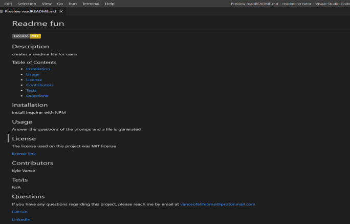

# Readme generator

## Overview

When creating projects on GitHub it is important to have a high-quality README file, so that you can displays the hard work you put into your project. This program helps a user create a high-quality README file by asking a series of questions and generating the README file for the user.

### learning points

- new javascript libraries
- working with node
- understanding CLI

## User Story

```
AS A developer
I WANT a README generator
SO THAT I can quickly create a professional README for a new project
```

## Acceptance Criteria

```
GIVEN a command-line application that accepts user input
WHEN I am prompted for information about my application repository
THEN a high-quality, professional README.md is generated with the title of my project and sections entitled Description, Table of Contents, Installation, Usage, License, Contributing, Tests, and Questions
WHEN I enter my project title
THEN this is displayed as the title of the README
WHEN I enter a description, installation instructions, usage information, contribution guidelines, and test instructions
THEN this information is added to the sections of the README entitled Description, Installation, Usage, Contributing, and Tests
WHEN I choose a license for my application from a list of options
THEN a badge for that license is added near the top of the README and a notice is added to the section of the README entitled License that explains which license the application is covered under
WHEN I enter my GitHub username
THEN this is added to the section of the README entitled Questions, with a link to my GitHub profile
WHEN I enter my email address
THEN this is added to the section of the README entitled Questions, with instructions on how to reach me with additional questions
WHEN I click on the links in the Table of Contents
THEN I am taken to the corresponding section of the README
```

## Technologies

- **JavaScripts**
- **Node.js**
- **Inquirer.js**
- **NPM**

## Screenshot/mockup



## CodeSnippets

### A Cut-down version of the license-link/badge svg

``` javascript
function renderLinkAndBadge(license) {
	let badge;
	switch (license) {
		case 'MIT license':
			badge = [
				'',
				'https://opensource.org/licenses/MIT',
			];
			break;
		case 'IBM license':
			badge = [
				'',
				'https://opensource.org/licenses/IPL-1.0',
			];
			break;
		default:
			badge = ['', ''];
			break;
	}
	return badge;
}
```

## License

Please refer to the LICENSE in the repo.

## Links - Contact Information

[Video Link](https://drive.google.com/file/d/1QiN2lY7BYbvbIuu7etDqEN6nydtGjj-G/view)

[LinkedIn](https://www.linkedin.com/in/kyle-s-vance)
